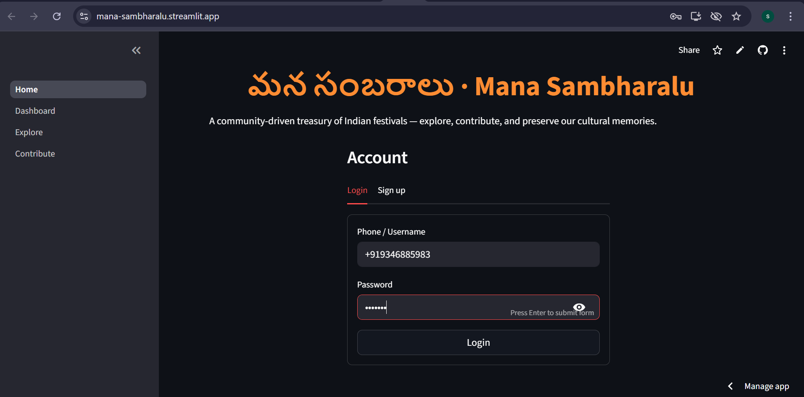
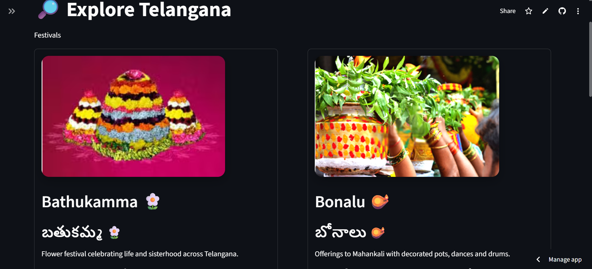
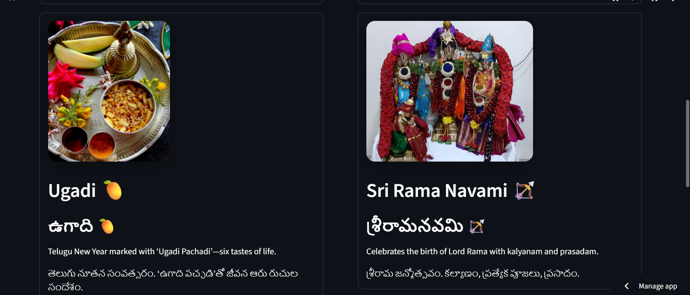
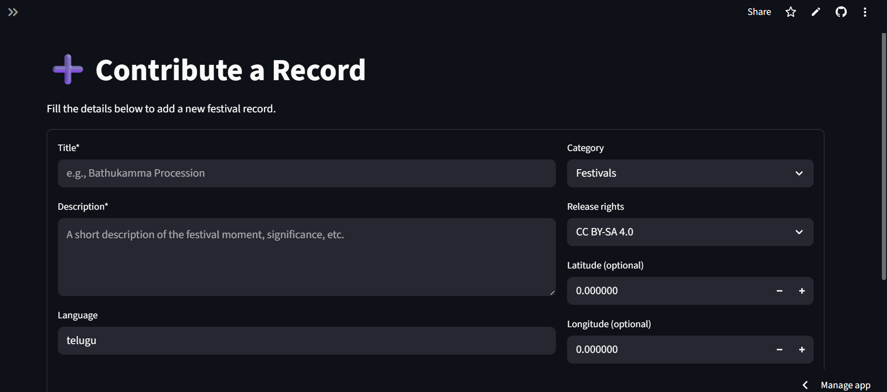

# మన సంబరాలు · Mana Sambharalu 🎉

A community-driven treasury of Indian festivals — **explore**, **contribute**, and **preserve** our cultural memories.  
Built with Streamlit and a warm **orange / black / white / grey** theme 🧡🖤🤍

---

## 🔗 Live App

- **Streamlit:** https://mana-sambharalu.streamlit.app

---

> In Demo Mode the app does not call a real API. Logging in simply unlocks the UI.

---

## 📸 Screenshots

> If an image does not render on GitHub/GitLab, make sure the file exists and is **committed** at the same path.

<p align="center">
  
</p>

<p float="left">
  
  
</p>

<p align="center">
  
</p>

_Screenshot files live in **assets/screenshots/**. Replace them with your own images if you like (keep the same file names or update the paths above)._

---

## ✨ Features

- 🔐 **Login / Sign-up (Demo)** – simple session state; “demo123” unlocks Explore & Contribute.
- 🔎 **Explore** – bilingual (English/తెలుగు) festival cards with **uniform image sizes**.
- ➕ **Contribute** – add records (title, language, rights, geotags, demo media preview).
- 🧡 **Theme** – orange headline accents, dark surface, soft card shadows, rounded corners.
- 🌁 **Background** – blurred Devi image applied globally via a small CSS helper.

---

## 🧱 Tech Stack

- **Python 3.10+**, **Streamlit**
- Light CSS via `st.markdown` for background & cards
- Packaging with **pyproject.toml** (works great with `uv`)

---

## 📂 Project Structure (partial)

assets/
bg/
goddess_bg.png
festivals/
home.png
explore1.png
explore2.png
contribute.png
config/
settings.py
pages/
1_Dashboard.py
2_Explore.py
3_Contribute.py
utils/
api_client.py
ui.py
Home.py
pyproject.toml

yaml
Copy code

---

## ▶️ Run Locally

### Using uv

```bash
uv sync
uv run streamlit run Home.py
Using pip (virtual env)
bash
Copy code
python -m venv .venv
# Windows
. .venv/Scripts/activate
# macOS/Linux
# source .venv/bin/activate

pip install -r <(uv pip compile pyproject.toml)  # or just install packages from pyproject with pip/uv
streamlit run Home.py
👥 Team

Sree Tripura — https://code.swecha.org/SreeTripura

Vaishnavi Bussa — https://code.swecha.org/vaishnavibussa

Gayathri Kodipaka — https://code.swecha.org/Gayathrikodipaka

Deekshitha M — https://code.swecha.org/DeekshithaM

Sudhamsh — https://code.swecha.org/Sudhamsh22


```
